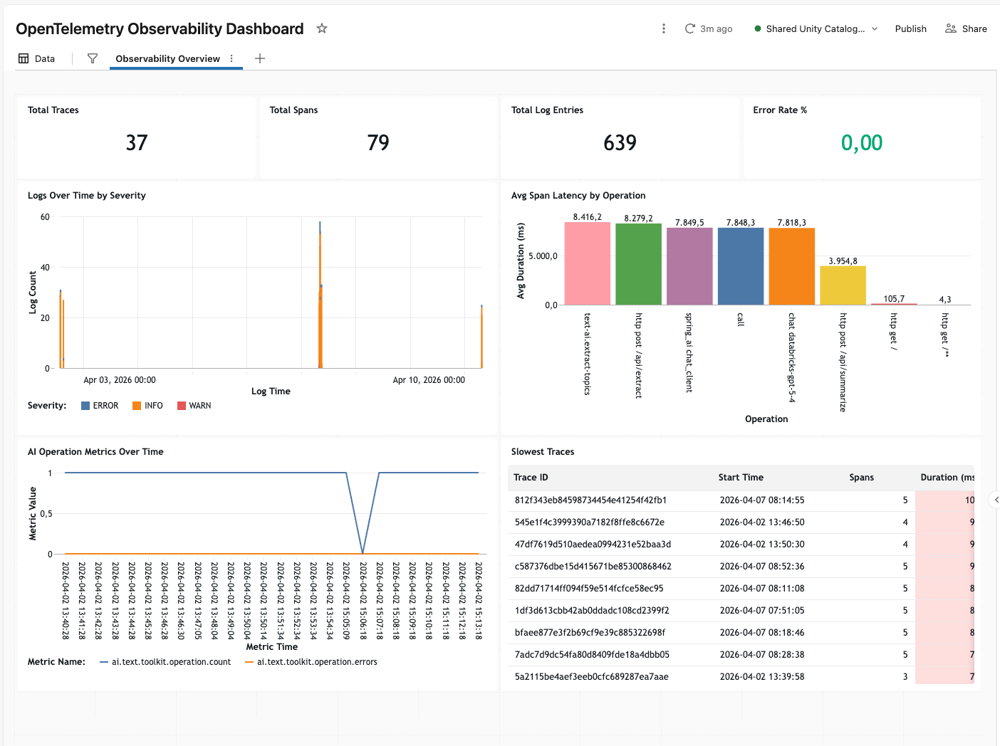

# Databricks OTel Spring Boot Demo

A Spring Boot demo application showing how to send **AI traces, application logs, and metrics** into Databricks Unity Catalog via the native OpenTelemetry ingestion endpoint. Uses Spring AI to call an AI Gateway model and exports the full OTel signal triad — traces, logs, and metrics. AI traces are visible in the MLflow Experiments UI with full prompt and completion content.

## OTel Export

Exports over **OTLP/HTTP protobuf** to the Databricks OTel endpoint (`/api/2.0/otel/v1/{traces,logs,metrics}`). Each request carries a `X-Databricks-UC-Table-Name` header to route data to the correct Unity Catalog table. Auth uses the standard Databricks SDK token (`config.authenticate()`), supporting PATs and OAuth.

- Tables are created automatically by `mlflow.set_experiment_trace_location()` — do not create manually.
- Traces are visible in the **MLflow Experiments UI**.

## Prerequisites

- Java 25+
- Maven 3.9+ (or use the included `./mvnw` wrapper)
- Databricks workspace with Unity Catalog enabled
- A `.databrickscfg` profile with valid credentials (PAT or OAuth), or equivalent environment variables
- A SQL warehouse you have access to
- An AI Gateway model (e.g., `databricks-gpt-5-4`)

## Setup


### 1. Create the MLflow Experiment and OTel Spans Table

Run [`setup/ML Setup.py`](setup/ML%20Setup.py) as a Databricks notebook. It creates an MLflow experiment and links it to a UC schema — Databricks automatically creates the OTel spans table used for AI trace ingestion.

The notebook prints the full spans table name, e.g. `my_catalog.my_schema.otel_spans`. The part before `_spans` is your `table-prefix` for the next step.

> Logs and metrics land in `<prefix>_logs` and `<prefix>_metrics` in the same schema, created automatically on first write.

### 2. Grant Permissions

Grant these permissions to the user or service principal in your `.databrickscfg` profile:

```sql
GRANT USE_CATALOG ON CATALOG <catalog> TO `<principal>`;
GRANT USE_SCHEMA ON SCHEMA <catalog>.<schema> TO `<principal>`;
GRANT MODIFY, SELECT ON TABLE <catalog>.<schema>.<prefix>_spans TO `<principal>`;
GRANT MODIFY, SELECT ON TABLE <catalog>.<schema>.<prefix>_logs TO `<principal>`;
GRANT MODIFY, SELECT ON TABLE <catalog>.<schema>.<prefix>_metrics TO `<principal>`;
```

> **Note:** `ALL_PRIVILEGES` is not sufficient due to a known issue.

### 3. Configure the Application

Edit `src/main/resources/application.properties`:

```properties
# Your ~/.databrickscfg profile name, or DEFAULT to use env vars
# (DATABRICKS_HOST + DATABRICKS_TOKEN, or OAuth)
databricks.config-profile=DEFAULT

# Unity Catalog location — match what the setup notebook used
databricks.otel.catalog=my_catalog
databricks.otel.schema=my_schema
# The prefix printed by the setup notebook (before "_spans")
databricks.otel.table-prefix=otel

# AI Gateway model
spring.ai.openai.chat.options.model=databricks-gpt-5-4
```

## Run

```bash
./mvnw spring-boot:run
```

Then open [http://localhost:8080](http://localhost:8080).

## Verify in Databricks

**AI Traces:** Open the MLflow Experiments UI and navigate to the experiment created in step 1 — traces appear there in real time with full prompt and completion content.

**Logs and Metrics:** Query the Delta tables directly in Databricks SQL:

```sql
-- Application logs
SELECT trace_id, severity_text, body, attributes
FROM <catalog>.<schema>.<prefix>_logs
ORDER BY time_unix_nano DESC
LIMIT 20;

-- Spans (raw trace data)
SELECT trace_id, name, start_time_unix_nano, end_time_unix_nano, attributes
FROM <catalog>.<schema>.<prefix>_spans
ORDER BY start_time_unix_nano DESC
LIMIT 20;

-- Metrics
SELECT * FROM <catalog>.<schema>.<prefix>_metrics
ORDER BY time_unix_nano DESC
LIMIT 20;
```

## Build a Dashboard with Genie Code

Once data is flowing, use [Genie Code](https://www.databricks.com/blog/introducing-genie-code) — the AI agent built into your Databricks workspace — to generate an AI/BI dashboard from the OTel tables. Open a notebook or the SQL editor, point Genie Code at your schema, and describe the dashboard you want:

> *"Create a dashboard from `<catalog>.<schema>.<prefix>_spans`, `<prefix>_logs`, and `<prefix>_metrics` showing AI operation latency, error rates, token usage, and log volume over time."*

Genie Code will generate the queries, configure the visualizations, and assemble the layout — no manual SQL required.



## Auth Notes

The app uses the **Databricks SDK for Java** to resolve credentials. It supports:

| Method | How to configure |
|--------|-----------------|
| Profile (default) | Set `databricks.config-profile` to a profile in `~/.databrickscfg` |
| PAT via env vars | `DATABRICKS_HOST` + `DATABRICKS_TOKEN` (set `config-profile` to `DEFAULT` or remove it) |
| OAuth M2M | `DATABRICKS_CLIENT_ID` + `DATABRICKS_CLIENT_SECRET` + `DATABRICKS_HOST` |

OTel exporters call `config.authenticate()` on every request, so token rotation is handled automatically.

## Tech Stack

| Component | Technology |
|-----------|-----------|
| Runtime | Java 25 |
| Framework | Spring Boot 4.0.4 |
| AI Client | Spring AI 2.0.0-M3 (OpenAI-compatible) |
| Observability | OpenTelemetry SDK + Micrometer (OTLP/protobuf) |
| Tracing UI | Databricks MLflow Experiments |
| Frontend | HTMX + Thymeleaf |
| Auth | Databricks SDK for Java (profile-based or env vars) |
